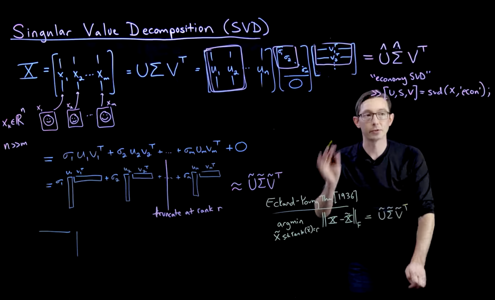
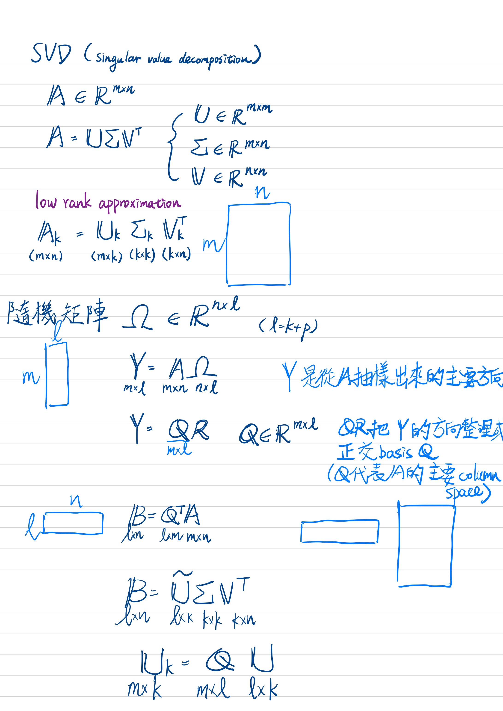

# Note: Randomized SVD

## Low-rank Approximation

有些情境下（例如具有規律的圖片、）一個矩陣會有很多接近 0 的 singular value。這些病態的 singular value（極度接近 0）對應到現實情境下通常是噪聲。

因此實務上（圖片壓縮、機器學習的 PCA）通常都是做 truncated SVD（將 singular value 由大排到小，並且只保留前面特定比例的 singular values）。

> 
> Ref: https://www.youtube.com/watch?v=xy3QyyhiuY4


### Definition

將 $A$ 做 SVD：
$$
A = U \Sigma V^T
$$
其中 $\sigma_1 \geq \sigma_2 \geq \cdots \geq \sigma_n$ 是 $A$ 的 singular values，$u_i, v_i$ 分別是對應的第 $i$ 個 left, right singular vector。

則 $A$ 的 Truncated SVD：
$$
A_k = \sigma_1 u_1 v^T_1 + \sigma_2 u_2 v^T_2 + \cdots + \sigma_k u_k v^T_k
$$


### Accuracy 

定義兩個矩陣差值的 Frobenius norm：
$$
||A - B||_F = \sqrt{\sum_{i = 1}^{m}\sum_{j = 1}^{n} |a_{ij} - b_{ij}|^2}
$$

Eckart-Young Theorem：$A$ 的最佳 rank-$k$ approximation（使 Frobenius norm 最小）就是 truncated SVD。


## Single-core Randomized SVD

Intuition：利用隨機矩陣讓 $A$ 的 dominant column vectors 浮出來，算是解決 Low-rank Approximation 的一個非常有效率的隨機演算法。

<p align="center">
  
</p>


給定矩陣 $A \in \mathbb{R}^{m \times n}$，目標 rank $k$，oversampling 參數 $p$：

1. **令 $l = k + p$**
2. **產生隨機矩陣 $\Omega \in \mathbb{R}^{n \times l}$**
    - $\Omega$ 可用 Gaussian matrix、random sign matrix、structured random matrix 之類的
3. **令 $Y = A \Omega$**
    - $Y \in \mathbb{R}^{m \times l}$
    - 這步目的是取樣 $A$ 的 column space。
4. **令 $Y = QR$**
    - 這步是對 $Y$ 做 QR 分解。
    - 這裡的 $Q \in \mathbb{R}^{m \times l}$ 就是低維 subspace 的 orthonormal basis。
5. **將 $A$ 投影到這個 subspace**
   $$
   B = Q^T A
   $$
6. **對小矩陣 $B$ 做 full SVD**
   $$
   B = \tilde{U} \Sigma V^T
   $$
7. **把 $\tilde{U}$ 映射回原空間**
   $$
   U = Q \tilde{U}
   $$
8. **只保留前 $k$ 個 singular values / vectors**
   $$
   A \approx U_k \Sigma_k V_k^T
   $$

> 操作成本從「直接對 $m \times n$ 的 $A$ 做 SVD」變成：
> - 計算 $Y = A\Omega$：$O(mnl)$
> - 對 tall-skinny matrix $Y \in \mathbb{R}^{m \times l}$ 做 QR：$O(ml^2)$
> - 計算 $B = Q^T A$：$O(mnl)$
> - 對小矩陣 $B \in \mathbb{R}^{l \times n}$ 做 SVD：$O(nl^2)$
>
> 因此 single-core randomized SVD 的主要成本約為 $O(mnl + ml^2 + nl^2)$。
> 
> 若加上 $q$ 次 power iteration，會多出約 $O(2qmnl)$ 的矩陣乘法成本。
>
> 當 $k + p \ll \min(m, n)$ 時，這會比 full SVD 的 $O(mn\min(m,n))$ 低很多。

### Power Iteration

為了減小誤差，可將 $Y$ 改成
$$
Y = (AA^T)^q A \Omega
$$

$q$ 常見取 $1$ 或 $2$。實作時通常不會真的計算 $AA^T$，而是反覆做：
```text
Y = A * Omega
Repeat q times:
    Y = A * (A^T * Y)
```

Power iteration 的 intuition：若 $A$ 的 singular values 是 $\sigma_1, \sigma_2, \cdots$，經過 $(AA^T)^q A$ 後，對應權重會變成：
$$
\sigma_i^{2q+1}
$$
大的 singular values 會被放得更大，因此 dominant subspace 會更容易被抓出來。

### Pseudocode

```text
Input:
  A: m x n matrix
  k: target rank
  p: oversampling parameter
  q: number of power iterations

l = k + p
Omega = random_matrix(n, l)

Y = A * Omega
Repeat q times:
    Y = A * (A^T * Y)

Q, R = qr(Y)
B = Q^T * A

U_tilde, Sigma, Vt = svd(B)
U = Q * U_tilde

return U[:, 1:k], Sigma[1:k, 1:k], Vt[1:k, :]
```

在 single-core implementation 中，這些步驟都會由單一 CPU process 依序完成。矩陣乘法、QR decomposition、以及小矩陣的 SVD 可以直接使用 BLAS / LAPACK。這種版本的重點不是平行化，而是先驗證 randomized SVD 的數學流程與 approximation quality，之後再把主要 bottleneck 拆到 multi-core 或 multi-GPU 上。


### Accuracy

Randomized SVD 的誤差主要來自 $Q$ 是否準確捕捉 $A$ 的 dominant column space。若 $A$ 的 singular values 下降很快，前 $k$ 個 singular values 已經能解釋大部分能量，則 randomized SVD 通常能得到接近 truncated SVD 的結果。

常用的檢查方式是 reconstruction error：
$$
\frac{\lVert A - U_k \Sigma_k V_k^T \rVert_F}{\lVert A \rVert_F}
$$

其中 $\lVert \cdot \rVert_F$ 是 Frobenius norm。這個值越小，代表低秩近似越接近原矩陣。


## Multi-core Randomized SVD

(Refer to README.md)
