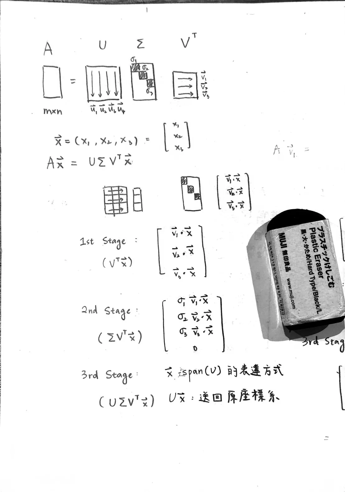
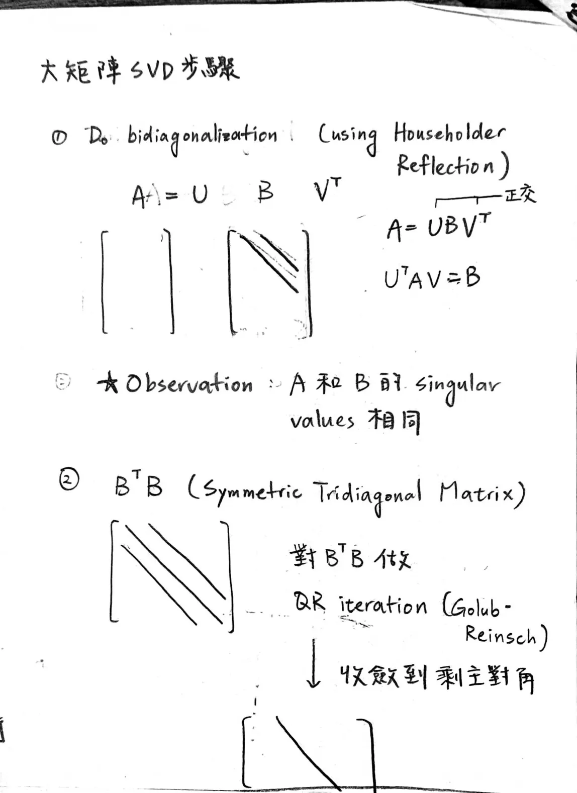

# Note: SVD

## Prerequisite Knowledge

### 0. 正交矩陣 (Orthogonal Matrix)

$n \times n$ 矩陣 $Q$ 是正交矩陣 $\iff$ $Q$ 的所有 column vectors 標準正交（長度為 $1$ 且互相內積 $= 0$）

正交矩陣性質：
- $Q^T Q = I$，即 $Q^{-1} = Q^T$

### 1. Eigenvectors and Eigenvalues

Eigenvector 指的是在某個線性變換下，行為表現得像單純拉伸的向量。Eigenvalue 是縮放倍率。

一個 $n \times n$ 的矩陣 $A$，若對於某個非 $0$ 向量 $v (\neq 0)$ 滿足：
$$
Av = \lambda v
$$

則稱 $\lambda$ 是 $A$ 的其中一個 eigenvalue，$v$ 是 $A$ 的其中一個 eigenvector。

矩陣的譜（Spectrum）就是他的 eigenvalues 集合。

### 2. 對角化

若 $n \times n$ 矩陣 $A$ 的 $n$ 個 eigenvectors 線性獨立，則可以將 $A$ 對角化：
$$
A = P D P^{-1}
$$
其中
$$D = \begin{bmatrix}
\lambda_1 &  &  &  \\
 & \lambda_2 &  &  \\
 &  & \ddots &  \\
 &  &  & \lambda_n
\end{bmatrix}, \quad
P = \begin{bmatrix}
\ \vert & \ \vert & & \ \vert \ \\
v_1 & v_2 & \cdots & v_n \\
\ \vert & \ \vert & & \ \vert \
\end{bmatrix}
$$

### 3. 對稱矩陣與譜定理 (Spectral Theorem)

$n \times n$ 的矩陣 $M$ 是對稱矩陣 $\iff$ $M_{ij} = M_{ji}$ for all $1 \leq i, j \leq n$

> 譜定理：$M$ 的對角化 $M = Q \Lambda Q^T$ 必定滿足 $Q$ 是正交矩陣。

這意味著，線性變換 $Mx$ 可以看成是「將 $x$ 送進 $\text{span}(Q)$」$\rightarrow$「伸縮」$\rightarrow$「將 $x$ 送回標準座標系」。

此外還有一個 SVD 會用到的重要性質，對於任何 $m \times n$ 的矩陣 $A$，$A^TA$ 與 $AA^T$ 都是對稱矩陣。

## Singular Value Decomposition

任何一個 $m \times n$ 的矩陣 $A$ 都可以分解成如下：
$$
A = U \Sigma V^T\\
(\mathbb{R}^{m \times n} = \mathbb{R}^{m \times m} \ \mathbb{R}^{m \times n} \ \mathbb{R}^{n \times n} )
$$

其中 $U, V$ 皆是正交矩陣，$\Sigma$ 是對角矩陣，對角線上的元素 $\sigma_1, \sigma_2, \cdots, \sigma_{\min(m, n)}$ 是 $A$ 的 singular values。

假設已將 $A$ 做了 SVD，$Ax$ 可以看成進行 3 步驟：
1. 將 $x$ 送進 $\text{span}(V)$ 的世界（因為對於正交矩陣 $V$，$V^{-1} = V^T$），也就是將 $x$ 轉換成 $\text{span}(V)$ 世界內的表達方式 $x'$。
2. 在 $\text{span}(V)$ 的世界底下將 $x'$ 各分量進行拉伸，第 $i$ 個維度的拉伸係數就是第 $i$ 個 singular value。
3. 根據拉伸過後的結果 $x''$，在 $\text{span}(U)$ 的世界裡找到另外一個各分量都跟 $x''$ 一樣的向量 $y$，然後把 $y$ 轉換成標準座標系的表達方法。

  

> 此外是 SVD 的一些觀察：
> - $U$ 是 left singular vectors，對應的是 $AA^T$ 的 eigenvectors。
> - $V$ 是 right singular vectors，對應的是 $A^TA$ 的 eigenvectors。
> - $\Sigma$ 是對角矩陣，對角線上都是 singular values，且 singular values $= \sqrt{AA^T \ 的非零特徵值}$，另外 $AA^T$ 跟 $A^TA$ 都是**對稱正半定**且**非零特徵值集合**是一樣的。

## SVD Implementation

- `cusolverDnSgesvd`：
  1. 先用類似 Householder reflection 的方式將矩陣雙對角化（$A = U B V^T$，$B$ 是 bidiagonal matrix）。數學可證明 $A, B$ 的 singular values 相同。
  2. 對 $B$ 做 QR iteration，讓雙對角收斂到只剩主對角。
  

    
  

- `cusolverDnSgesvdj`：Jacobi SVD
- Randomized SVD

